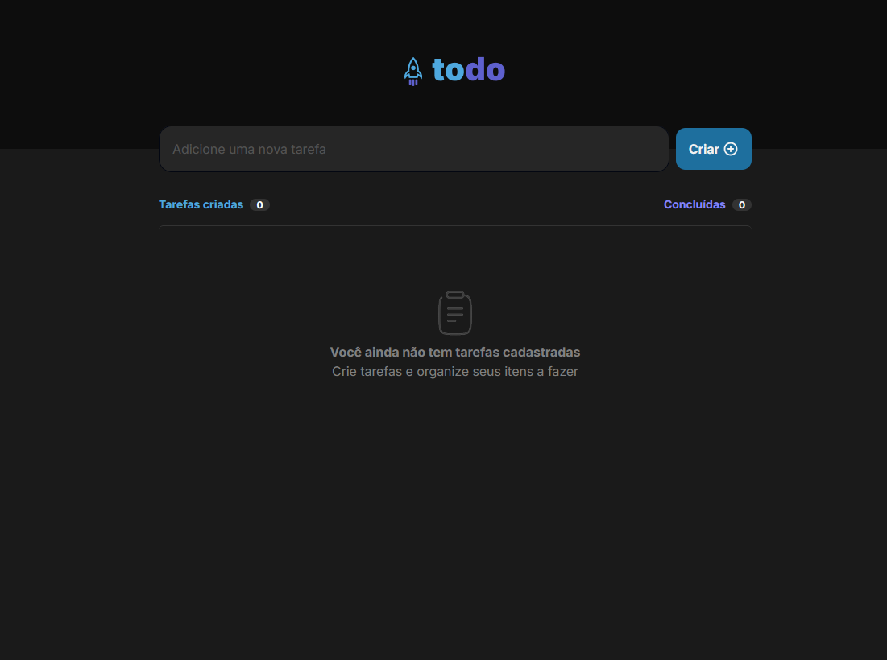
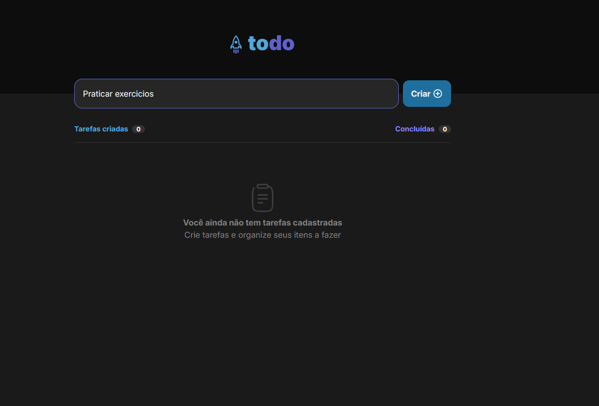
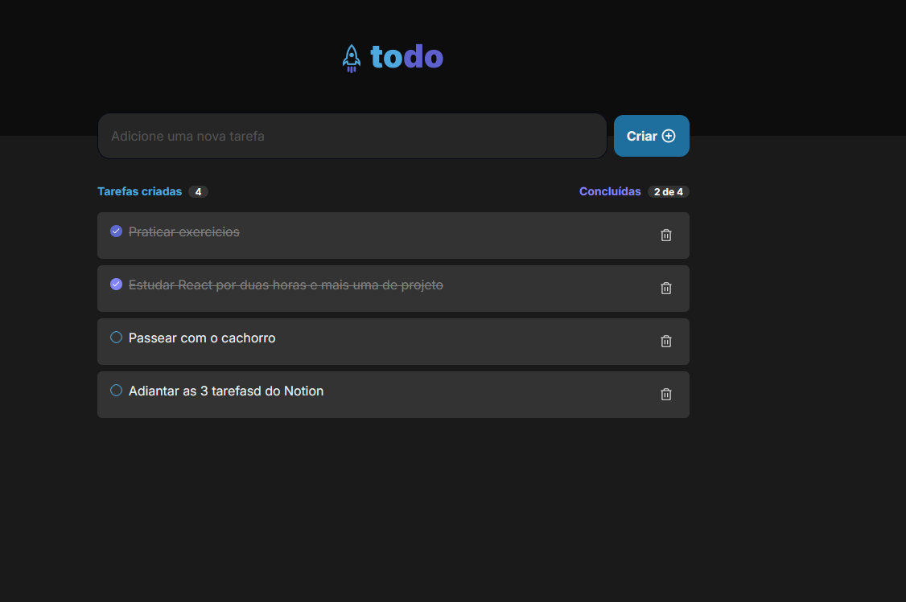

## Todo App

[🇬🇧 English](#todo-app-english) | [🇧🇷 Português](#todo-app-português)

---

## Todo App English

A simple To-Do application built with React, TailwindCSS, and TypeScript.

:globe_with_meridians: [Deploy](https://to-do-react-three-alpha.vercel.app/)

📌 Features

- [x] Add a new task

- [x] Mark a task as completed

- [x] Delete a task

🚀 Technologies Used

[](https://skillicons.dev) 

📸 Demo

📍 Home Screen




✅ Marking a Task as Completed




🔧 How to Run the Project

Clone the repository:

git clone https://github.com/Cleber-Severo/to-do-react.git

Navigate to the project folder:

cd todo-app

Install dependencies:
```
npm install

Start the development server:

npm run dev
```

📜 License

This project is licensed under the MIT License. Feel free to use and modify it!

Developed with ❤️ by Cléber Severo 🚀


## Todo App Português

Um simples aplicativo de tarefas (To-Do) desenvolvido com React, TailwindCSS e TypeScript.

:globe_with_meridians: [Deploy](https://to-do-react-three-alpha.vercel.app/)

📌 Funcionalidades

- [x] Adicionar uma nova tarefa

- [x] Marcar uma tarefa como concluída

- [x] Excluir uma tarefa

🚀 Tecnologias Utilizadas

[](https://skillicons.dev) 

📸 Demonstração

📍 Página Inicial


✅ Marcando uma tarefa como concluida


🔧 Como Rodar o Projeto

Clone o repositório:

git clone https://github.com/Cleber-Severo/to-do-react.git

Acesse a pasta do projeto:

cd todo-app

Instale as dependências:
```
npm install

Start the development server:

npm run dev
```

📜 Licença

Este projeto está licenciado sob a MIT License. Sinta-se livre para utilizá-lo e modificá-lo!

Desenvolvido com ❤️ por Cléber Severo 🚀

